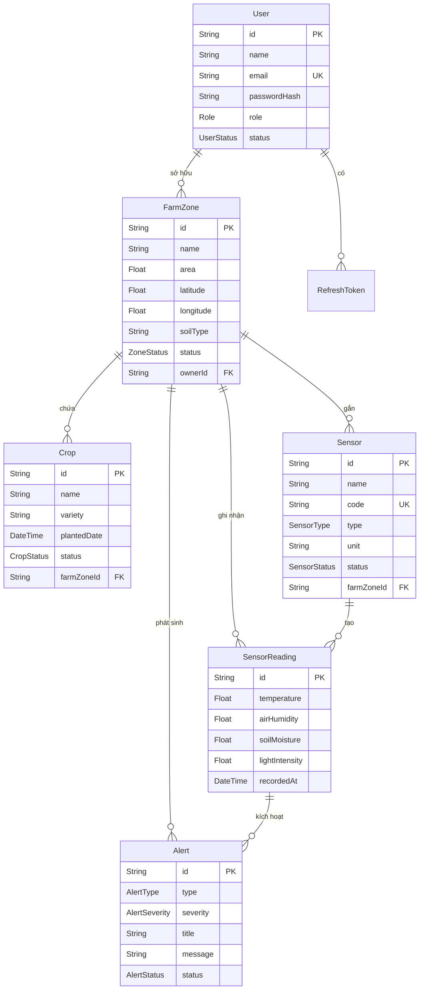

<p align="center">
  <h1 align="center">🌾 Smart Farm Monitoring System</h1>
  <p align="center">
    Hệ thống Giám sát Nông trại Thông minh — Quản lý vùng trồng, cảm biến IoT, dữ liệu môi trường và cảnh báo theo thời gian thực.
  </p>
</p>

<p align="center">
  
  
  
  
  
  
  
</p>

---

## 📑 Mục lục

- [Tổng quan dự án](#-tổng-quan-dự-án)
- [Tính năng chính](#-tính-năng-chính)
- [Kiến trúc hệ thống](#-kiến-trúc-hệ-thống)
- [Công nghệ sử dụng](#-công-nghệ-sử-dụng)
- [Cấu trúc thư mục](#-cấu-trúc-thư-mục)
- [Mô hình dữ liệu (ERD)](#-mô-hình-dữ-liệu-erd)
- [Yêu cầu hệ thống](#%EF%B8%8F-yêu-cầu-hệ-thống)
- [Hướng dẫn cài đặt (Local)](#-hướng-dẫn-cài-đặt-local)
- [Hướng dẫn cài đặt (Docker)](#-hướng-dẫn-cài-đặt-docker)
- [Biến môi trường](#-biến-môi-trường)
- [API Endpoints](#-api-endpoints)
- [WebSocket (Real-time)](#-websocket-real-time)
- [Kiểm thử](#-kiểm-thử)
- [Tài liệu bổ sung](#-tài-liệu-bổ-sung)
- [Đóng góp](#-đóng-góp)

---

## 🌍 Tổng quan dự án

**Smart Farm Monitoring System** là một ứng dụng web fullstack giúp nông dân và kỹ sư nông nghiệp:

- **Quản lý vùng trồng** (Farm Zones) với thông tin diện tích, tọa độ GPS, loại đất.
- **Theo dõi cây trồng** (Crops) theo chu kỳ sinh trưởng từ gieo trồng đến thu hoạch.
- **Giám sát cảm biến IoT** (Sensors) thu thập dữ liệu nhiệt độ, độ ẩm không khí, độ ẩm đất, cường độ ánh sáng.
- **Nhận cảnh báo tự động** (Alerts) khi chỉ số môi trường vượt ngưỡng an toàn — hỗ trợ phản ứng nhanh.
- **Trực quan hóa dữ liệu** qua biểu đồ thống kê và bản đồ tương tác (Leaflet).
- **Cập nhật real-time** thông qua WebSocket (Socket.IO).

Dự án được tổ chức theo kiến trúc **Monorepo**, phân tách rõ ràng giữa Frontend và Backend.

---

## ✨ Tính năng chính

### 🔐 Xác thực & Phân quyền
- Đăng ký / Đăng nhập / Đăng xuất
- Quên mật khẩu với OTP qua email (Nodemailer / Resend)
- JWT Access Token + Refresh Token (HttpOnly Cookie, xoay vòng token)
- Phân quyền theo vai trò: `ADMIN` và `USER`

### 🗺️ Quản lý Vùng trồng
- CRUD vùng trồng với tọa độ GPS (latitude/longitude)
- Hiển thị trên bản đồ tương tác (Leaflet / React-Leaflet)
- Lọc theo trạng thái: `ACTIVE`, `INACTIVE`, `MAINTENANCE`

### 🌱 Quản lý Cây trồng
- CRUD cây trồng theo vùng
- Theo dõi trạng thái sinh trưởng: `PLANTED` → `GROWING` → `HARVESTED` / `DISEASED`
- Nhập hàng loạt qua Excel (ExcelJS)

### 📡 Cảm biến IoT
- CRUD thiết bị cảm biến (mã định danh ESP32, loại cảm biến, đơn vị đo)
- Hỗ trợ các loại: `TEMPERATURE`, `AIR_HUMIDITY`, `SOIL_MOISTURE`, `LIGHT_INTENSITY`, `ALL_IN_ONE`
- Job giả lập dữ liệu cảm biến tự động (Sensor Mock Job) với interval tùy chỉnh

### 📊 Dữ liệu đo & Thống kê
- Ghi nhận dữ liệu đo theo chuỗi thời gian (time-series) với index tối ưu
- Biểu đồ trực quan hóa qua Recharts
- Xuất báo cáo dữ liệu ra Excel
- Tìm kiếm toàn cục (Global Search)

### 🚨 Hệ thống Cảnh báo
- Tự động phát sinh cảnh báo khi dữ liệu vượt ngưỡng
- Phân loại cảnh báo: `CRITICAL_WEATHER`, `SOIL_DRY`, `OVERHEATING`, `SENSOR_MALFUNCTION`, `PEST_RISK`,...
- Mức độ nghiêm trọng: `INFO`, `WARNING`, `CRITICAL`
- Quản lý trạng thái: `OPEN` → `ACKNOWLEDGED` → `RESOLVED`

### ⚡ Real-time
- WebSocket (Socket.IO) đẩy dữ liệu cảm biến và cảnh báo theo thời gian thực
- Room-based: mỗi vùng trồng có room riêng, admin có room tổng hợp
- Xác thực socket bằng JWT

### 🤖 Trợ lý AI
- Trang Farm Guide tích hợp AI Assistant Chat hỗ trợ tư vấn nông nghiệp

---

## 🏗 Kiến trúc hệ thống

```
┌─────────────────────────────────────────────────────────────┐
│                        CLIENT                               │
│  Next.js 16 + React 19 + TailwindCSS + shadcn/ui + Zustand │
│  Recharts (Biểu đồ) | React-Leaflet (Bản đồ) | Socket.IO  │
└──────────────────────────┬──────────────────────────────────┘
                           │  HTTP REST API / WebSocket
                           ▼
┌─────────────────────────────────────────────────────────────┐
│                        SERVER                               │
│  Express 5 + TypeScript + Zod (Validation)                  │
│  JWT Auth | Helmet | CORS | Rate Limit | Morgan | Swagger   │
│  Socket.IO Server | Sensor Mock Job | ExcelJS               │
└──────────────────────────┬──────────────────────────────────┘
                           │  Prisma ORM
                           ▼
┌─────────────────────────────────────────────────────────────┐
│                      DATABASE                               │
│  PostgreSQL (Supabase) — UUID Primary Keys                  │
│  Time-series Index trên SensorReading                       │
└─────────────────────────────────────────────────────────────┘
```

---

## 🛠 Công nghệ sử dụng

| Lớp | Công nghệ | Phiên bản |
|-----|-----------|-----------|
| **Frontend** | Next.js, React, TypeScript | 16, 19 |
| **UI Framework** | TailwindCSS 4, shadcn/ui, Lucide Icons | - |
| **State Management** | Zustand | 5 |
| **Form & Validation** | React Hook Form, Zod | 7, 4 |
| **Biểu đồ** | Recharts | 3 |
| **Bản đồ** | Leaflet, React-Leaflet | 1.9, 5 |
| **Backend** | Express.js, TypeScript | 5 |
| **ORM** | Prisma Client | 7 |
| **Cơ sở dữ liệu** | PostgreSQL (Supabase) | - |
| **Xác thực** | JWT (jsonwebtoken), bcryptjs | - |
| **Real-time** | Socket.IO | 4 |
| **Email** | Nodemailer, Resend | - |
| **Bảo mật** | Helmet, CORS, express-rate-limit | - |
| **Import/Export** | ExcelJS | 4 |
| **API Docs** | Swagger UI Express | 5 |
| **Testing** | Jest, Supertest, ts-jest | - |
| **DevOps** | Docker, Docker Compose | - |

---

## 📂 Cấu trúc thư mục

```
agriculture-and-environment/
├── apps/
│   ├── backend/
│   │   ├── prisma/
│   │   │   ├── schema.prisma          # Định nghĩa mô hình dữ liệu
│   │   │   ├── seed.ts                # Dữ liệu mẫu (seeder)
│   │   │   └── migrations/            # Lịch sử migration
│   │   ├── src/
│   │   │   ├── config/                # Cấu hình (env, cors, prisma)
│   │   │   ├── constants/             # Hằng số
│   │   │   ├── docs/                  # Swagger JSON
│   │   │   ├── jobs/                  # Background jobs (sensor mock, partition)
│   │   │   ├── middlewares/           # Auth, error, rate-limit, role, validate
│   │   │   ├── modules/              # Các module nghiệp vụ
│   │   │   │   ├── auth/             #   Xác thực (register, login, refresh, logout)
│   │   │   │   ├── farm-zones/       #   Quản lý vùng trồng
│   │   │   │   ├── crops/            #   Quản lý cây trồng
│   │   │   │   ├── sensors/          #   Quản lý cảm biến
│   │   │   │   ├── sensor-readings/  #   Dữ liệu đo cảm biến
│   │   │   │   ├── alerts/           #   Hệ thống cảnh báo
│   │   │   │   ├── statistics/       #   Thống kê
│   │   │   │   ├── exports/          #   Xuất dữ liệu (Excel)
│   │   │   │   ├── imports/          #   Nhập dữ liệu (Excel)
│   │   │   │   ├── search/           #   Tìm kiếm toàn cục
│   │   │   │   └── users/            #   Quản lý người dùng (Admin)
│   │   │   ├── sockets/              # WebSocket (Socket.IO)
│   │   │   ├── tests/                # Unit & Integration tests
│   │   │   ├── utils/                # Tiện ích (JWT, API Response,...)
│   │   │   ├── app.ts                # Khởi tạo Express app
│   │   │   └── server.ts             # Entry point
│   │   ├── Dockerfile
│   │   └── package.json
│   │
│   ├── frontend/
│   │   ├── src/
│   │   │   ├── app/                   # Next.js App Router
│   │   │   │   ├── auth/              #   Trang đăng nhập / đăng ký / quên mật khẩu
│   │   │   │   ├── dashboard/         #   Trang dashboard chính
│   │   │   │   │   ├── zones/         #     Quản lý vùng trồng
│   │   │   │   │   ├── crops/         #     Quản lý cây trồng
│   │   │   │   │   ├── sensors/       #     Quản lý cảm biến
│   │   │   │   │   ├── alerts/        #     Quản lý cảnh báo
│   │   │   │   │   ├── statistics/    #     Thống kê
│   │   │   │   │   ├── history/       #     Lịch sử dữ liệu đo
│   │   │   │   │   ├── map/           #     Bản đồ tương tác
│   │   │   │   │   ├── imports/       #     Nhập dữ liệu Excel
│   │   │   │   │   ├── admin/         #     Quản trị hệ thống
│   │   │   │   │   └── profile/       #     Hồ sơ cá nhân
│   │   │   │   └── farm-guide/        #   Trợ lý AI nông nghiệp
│   │   │   ├── components/            # Các component tái sử dụng
│   │   │   │   ├── ui/                #   shadcn/ui components
│   │   │   │   ├── layout/            #   Header, Sidebar, Layout
│   │   │   │   ├── dashboard/         #   Dashboard widgets
│   │   │   │   ├── charts/            #   Biểu đồ Recharts
│   │   │   │   ├── map/               #   Bản đồ Leaflet
│   │   │   │   ├── forms/             #   Form components
│   │   │   │   ├── alerts/            #   Cảnh báo UI
│   │   │   │   ├── auth/              #   Auth forms
│   │   │   │   ├── admin/             #   Admin panels
│   │   │   │   └── profile/           #   Profile components
│   │   │   ├── hooks/                 # Custom React hooks
│   │   │   ├── stores/                # Zustand stores (auth, realtime, theme)
│   │   │   ├── lib/                   # Utilities, API client
│   │   │   └── middleware.ts          # Next.js middleware (auth guard)
│   │   ├── Dockerfile
│   │   └── package.json
│   │
│   └── docker-compose.yml             # Docker Compose orchestration
│
├── docs/
│   ├── api-endpoints.md               # Tài liệu chi tiết API
│   ├── erd.md                         # Sơ đồ ERD & mô tả mô hình dữ liệu
│   ├── integration-checklist.md       # Checklist tích hợp
│   └── mau_import_cay_trong.csv       # Mẫu file CSV import cây trồng
│
├── postman/
│   └── smart-farm.postman_collection.json  # Bộ sưu tập API test Postman
│
└── README.md
```

---

## 🗄 Mô hình dữ liệu (ERD)



> 📖 Tài liệu chi tiết các bảng, trường dữ liệu và quan hệ: xem [`docs/erd.md`](docs/erd.md)

---

## ⚙️ Yêu cầu hệ thống

| Công cụ | Phiên bản tối thiểu | Ghi chú |
|---------|---------------------|---------|
| [Node.js](https://nodejs.org/) | v18+ | Khuyến nghị v20 LTS |
| [PostgreSQL](https://www.postgresql.org/) | 15+ | Hoặc sử dụng Supabase (cloud) |
| [Docker](https://www.docker.com/) | 24+ | Tùy chọn, nếu chạy qua container |
| [Docker Compose](https://docs.docker.com/compose/) | v2+ | Tùy chọn |

---

## 🚀 Hướng dẫn cài đặt (Local)

### Bước 1: Clone dự án

```bash
git clone https://github.com/<your-username>/agriculture-and-environment.git
cd agriculture-and-environment
```

### Bước 2: Cài đặt & Chạy Backend

```bash
# Di chuyển vào thư mục backend
cd apps/backend

# Cài đặt dependencies
npm install

# Tạo file biến môi trường
cp .env.example .env
# => Mở file .env và cập nhật DATABASE_URL, JWT secrets,...

# Khởi tạo Prisma Client
npm run prisma:generate

# Chạy database migration
npm run prisma:migrate

# (Tùy chọn) Seed dữ liệu mẫu
npm run prisma:seed

# Khởi động server ở chế độ development
npm run dev
```

> 🟢 Backend sẽ chạy tại: **http://localhost:5000**
> 📖 Swagger API Docs: **http://localhost:5000/api/docs**

### Bước 3: Cài đặt & Chạy Frontend

```bash
# Mở terminal mới, di chuyển vào thư mục frontend
cd apps/frontend

# Cài đặt dependencies
npm install

# Tạo file biến môi trường
cp .env.example .env.local
# => Kiểm tra NEXT_PUBLIC_API_URL trỏ đúng tới backend

# Khởi động frontend
npm run dev
```

> 🟢 Frontend sẽ chạy tại: **http://localhost:3000**

---

## 🐳 Hướng dẫn cài đặt (Docker)

### Bước 1: Chuẩn bị biến môi trường

```bash
# Thiết lập biến môi trường cho Backend
cp apps/backend/.env.example apps/backend/.env

# Thiết lập biến môi trường cho Frontend
cp apps/frontend/.env.example apps/frontend/.env
```

> ⚠️ **Lưu ý quan trọng:** Khi sử dụng Docker, nếu PostgreSQL chạy trên máy host, hãy thay `localhost` bằng `host.docker.internal` trong `DATABASE_URL`.

### Bước 2: Build & Chạy

```bash
cd apps

# Build và khởi chạy tất cả services
docker-compose up -d --build
```

| Service | URL | Port |
|---------|-----|------|
| Frontend | http://localhost:3000 | 3000 |
| Backend | http://localhost:5000 | 5000 |

### Các lệnh Docker hữu ích

```bash
# Xem logs real-time
docker-compose logs -f

# Xem logs của service cụ thể
docker-compose logs -f backend

# Dừng tất cả containers
docker-compose down

# Rebuild một service cụ thể
docker-compose up -d --build backend
```

---

## 🔑 Biến môi trường

### Backend (`apps/backend/.env`)

| Biến | Mô tả | Giá trị mẫu |
|------|--------|-------------|
| `PORT` | Cổng chạy server | `5000` |
| `NODE_ENV` | Môi trường | `development` / `production` |
| `CLIENT_URL` | URL Frontend (CORS) | `http://localhost:3000` |
| `DATABASE_URL` | Connection string PostgreSQL (pooling) | `postgresql://...` |
| `DIRECT_URL` | Connection string trực tiếp (migrations) | `postgresql://...` |
| `JWT_ACCESS_SECRET` | Secret key cho Access Token | *(tự tạo chuỗi ngẫu nhiên)* |
| `JWT_REFRESH_SECRET` | Secret key cho Refresh Token | *(tự tạo chuỗi ngẫu nhiên)* |
| `SENSOR_MOCK_ENABLED` | Bật/tắt giả lập cảm biến | `true` / `false` |
| `SENSOR_MOCK_INTERVAL_MS` | Chu kỳ giả lập (ms) | `1800000` (30 phút) |

### Frontend (`apps/frontend/.env.local`)

| Biến | Mô tả | Giá trị mẫu |
|------|--------|-------------|
| `NEXT_PUBLIC_API_URL` | URL Backend API | `http://localhost:5000` |
| `NEXT_PUBLIC_SOCKET_URL` | URL WebSocket server | `http://localhost:5000` |

---

## 📡 API Endpoints

Tất cả API đều có prefix `/api` và trả về response theo chuẩn:

```json
{
  "success": true,
  "message": "Mô tả kết quả",
  "data": { }
}
```

| Nhóm | Prefix | Mô tả |
|------|--------|--------|
| Health Check | `GET /api/health` | Kiểm tra trạng thái server |
| Database Ping | `GET /api/ping-db` | Kiểm tra kết nối database |
| Auth | `/api/auth` | Đăng ký, đăng nhập, refresh token, đăng xuất, quên mật khẩu |
| Farm Zones | `/api/farm-zones` | CRUD vùng trồng |
| Crops | `/api/crops` | CRUD cây trồng |
| Sensors | `/api/sensors` | CRUD cảm biến |
| Sensor Readings | `/api/sensor-readings` | Ghi nhận & truy vấn dữ liệu đo |
| Alerts | `/api/alerts` | Quản lý cảnh báo |
| Statistics | `/api/statistics` | Thống kê tổng hợp |
| Exports | `/api/exports` | Xuất dữ liệu ra Excel |
| Imports | `/api/imports` | Nhập dữ liệu từ Excel |
| Search | `/api/search` | Tìm kiếm toàn cục |
| Users | `/api/users` | Quản lý người dùng (Admin) |

> 📖 Tài liệu chi tiết từng endpoint (request/response mẫu): xem [`docs/api-endpoints.md`](docs/api-endpoints.md)
>
> 🔗 Swagger UI: **http://localhost:5000/api/docs**
>
> 📬 Postman Collection: xem [`postman/smart-farm.postman_collection.json`](postman/smart-farm.postman_collection.json)

---

## 🔌 WebSocket (Real-time)

Hệ thống sử dụng **Socket.IO** để đẩy dữ liệu real-time tới client.

### Kết nối

```javascript
import { io } from "socket.io-client";

const socket = io("http://localhost:5000", {
  auth: { token: "<accessToken>" }
});
```

### Room System

| Room | Mô tả | Quyền truy cập |
|------|--------|----------------|
| `user:<userId>` | Room cá nhân, tự động join khi kết nối | Tất cả user đã xác thực |
| `farm-zone:<farmZoneId>` | Room theo vùng trồng | Owner của vùng trồng + Admin |
| `admins` | Room dành cho admin | Chỉ `ADMIN` |

### Sự kiện (Events)

| Event | Mô tả |
|-------|--------|
| `sensor:reading-created` | Dữ liệu đo mới từ cảm biến (scoped theo farm zone) |
| `sensor:global-reading` | Dữ liệu đo mới (global broadcast) |
| `join-room` | Client yêu cầu tham gia room |
| `leave-room` | Client rời khỏi room |
| `room:joined` | Xác nhận đã join room thành công |
| `room:error` | Lỗi khi join room (không có quyền) |

---

## 🧪 Kiểm thử

### Chạy kiểm thử Backend

```bash
cd apps/backend

# Chạy toàn bộ test suite
npm test

# Chạy test cụ thể
npx jest --testPathPattern=auth.test.ts
```

### Các test hiện có

| File Test | Mô tả |
|-----------|--------|
| `auth.test.ts` | Kiểm thử xác thực (đăng ký, đăng nhập, token) |
| `farm.test.ts` | Kiểm thử CRUD vùng trồng |
| `exports.test.ts` | Kiểm thử xuất dữ liệu Excel |
| `alertRules.test.ts` | Kiểm thử quy tắc cảnh báo |
| `socket.test.ts` | Kiểm thử WebSocket |

### Kiểm thử API thủ công

Import file [`postman/smart-farm.postman_collection.json`](postman/smart-farm.postman_collection.json) vào Postman để test các endpoint.

---

## 📚 Tài liệu bổ sung

| Tài liệu | Đường dẫn | Mô tả |
|-----------|-----------|--------|
| API Endpoints | [`docs/api-endpoints.md`](docs/api-endpoints.md) | Chi tiết tất cả REST API endpoints |
| ERD & Database | [`docs/erd.md`](docs/erd.md) | Sơ đồ quan hệ thực thể & mô tả bảng |
| Integration Checklist | [`docs/integration-checklist.md`](docs/integration-checklist.md) | Checklist tích hợp Frontend ↔ Backend |
| Import CSV mẫu | [`docs/mau_import_cay_trong.csv`](docs/mau_import_cay_trong.csv) | File mẫu import cây trồng |
| Postman Collection | [`postman/smart-farm.postman_collection.json`](postman/smart-farm.postman_collection.json) | Bộ request API test |

---

## 🤝 Đóng góp

Mọi đóng góp đều được hoan nghênh! Vui lòng thực hiện theo quy trình sau:

1. **Fork** repository
2. Tạo nhánh tính năng:
   ```bash
   git checkout -b feature/ten-tinh-nang
   ```
3. Commit thay đổi:
   ```bash
   git commit -m "feat: mô tả tính năng mới"
   ```
4. Push lên remote:
   ```bash
   git push origin feature/ten-tinh-nang
   ```
5. Mở **Pull Request** và mô tả chi tiết thay đổi

### Quy ước Commit Message

| Prefix | Mô tả |
|--------|--------|
| `feat:` | Tính năng mới |
| `fix:` | Sửa lỗi |
| `docs:` | Cập nhật tài liệu |
| `refactor:` | Tái cấu trúc code |
| `test:` | Thêm/sửa test |
| `chore:` | Cập nhật config, dependencies |

---

<p align="center">
  Được phát triển với ❤️ bởi nhóm Thành Phát An 
</p>
