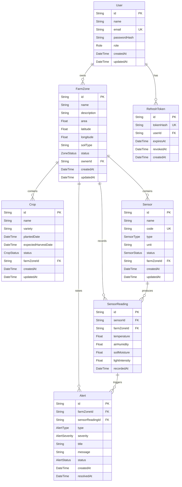

# ERD - Smart Farm Monitoring System

Tài liệu này mô tả mô hình dữ liệu chính của hệ thống dựa trên `apps/backend/prisma/schema.prisma`. Cơ sở dữ liệu sử dụng PostgreSQL, Prisma ORM, khóa chính dạng `String` với giá trị mặc định `uuid()`.

## 1. Bảng User

Lưu tài khoản đăng nhập và vai trò phân quyền.

| Trường | Kiểu | Ghi chú |
| --- | --- | --- |
| `id` | `String` | Khóa chính, UUID |
| `name` | `String` | Họ tên người dùng |
| `email` | `String` | Duy nhất |
| `passwordHash` | `String` | Mật khẩu đã băm, không trả về API |
| `role` | `Role` | `ADMIN`, `USER`; mặc định `USER` |
| `createdAt` | `DateTime` | Thời điểm tạo |
| `updatedAt` | `DateTime` | Tự động cập nhật khi sửa |

## 2. Bảng FarmZone

Lưu thông tin vùng trồng/nông trại con.

| Trường | Kiểu | Ghi chú |
| --- | --- | --- |
| `id` | `String` | Khóa chính, UUID |
| `name` | `String` | Tên vùng trồng |
| `description` | `String?` | Mô tả tùy chọn |
| `area` | `Float` | Diện tích, đơn vị m2 |
| `latitude` | `Float` | Vĩ độ |
| `longitude` | `Float` | Kinh độ |
| `soilType` | `String` | Loại đất/giá thể |
| `status` | `ZoneStatus` | `ACTIVE`, `INACTIVE`, `MAINTENANCE` |
| `ownerId` | `String` | Khóa ngoại tới `User.id` |
| `createdAt` | `DateTime` | Thời điểm tạo |
| `updatedAt` | `DateTime` | Tự động cập nhật khi sửa |

## 3. Bảng Crop

Lưu cây trồng trong từng vùng.

| Trường | Kiểu | Ghi chú |
| --- | --- | --- |
| `id` | `String` | Khóa chính, UUID |
| `name` | `String` | Tên cây trồng |
| `variety` | `String` | Giống cây |
| `plantedDate` | `DateTime` | Ngày trồng |
| `expectedHarvestDate` | `DateTime?` | Ngày dự kiến thu hoạch |
| `status` | `CropStatus` | `PLANTED`, `GROWING`, `HARVESTED`, `DISEASED` |
| `farmZoneId` | `String` | Khóa ngoại tới `FarmZone.id` |
| `createdAt` | `DateTime` | Thời điểm tạo |
| `updatedAt` | `DateTime` | Tự động cập nhật khi sửa |

## 4. Bảng Sensor

Lưu thiết bị cảm biến IoT được lắp đặt trong vùng trồng.

| Trường | Kiểu | Ghi chú |
| --- | --- | --- |
| `id` | `String` | Khóa chính, UUID |
| `name` | `String` | Tên cảm biến |
| `code` | `String` | Mã thiết bị duy nhất, ví dụ `ESP32-NODE-01` |
| `type` | `SensorType` | `TEMPERATURE`, `AIR_HUMIDITY`, `SOIL_MOISTURE`, `LIGHT_INTENSITY`, `ALL_IN_ONE` |
| `unit` | `String` | Đơn vị đo |
| `status` | `SensorStatus` | `ACTIVE`, `INACTIVE`, `ERROR` |
| `farmZoneId` | `String` | Khóa ngoại tới `FarmZone.id` |
| `createdAt` | `DateTime` | Thời điểm tạo |
| `updatedAt` | `DateTime` | Tự động cập nhật khi sửa |

## 5. Bảng SensorReading

Lưu dữ liệu đo theo thời gian từ cảm biến. Bảng này có index để tối ưu truy vấn chuỗi thời gian.

| Trường | Kiểu | Ghi chú |
| --- | --- | --- |
| `id` | `String` | Khóa chính, UUID |
| `sensorId` | `String` | Khóa ngoại tới `Sensor.id` |
| `farmZoneId` | `String` | Khóa ngoại tới `FarmZone.id` |
| `temperature` | `Float?` | Nhiệt độ |
| `airHumidity` | `Float?` | Độ ẩm không khí |
| `soilMoisture` | `Float?` | Độ ẩm đất |
| `lightIntensity` | `Float?` | Cường độ ánh sáng |
| `recordedAt` | `DateTime` | Thời điểm ghi nhận |

Index:

- `recordedAt`
- `farmZoneId, recordedAt`

## 6. Bảng Alert

Lưu cảnh báo phát sinh từ dữ liệu đo hoặc trạng thái thiết bị.

| Trường | Kiểu | Ghi chú |
| --- | --- | --- |
| `id` | `String` | Khóa chính, UUID |
| `farmZoneId` | `String` | Khóa ngoại tới `FarmZone.id` |
| `sensorReadingId` | `String?` | Khóa ngoại tùy chọn tới `SensorReading.id` |
| `type` | `AlertType` | `CRITICAL_WEATHER`, `SOIL_DRY`, `SENSOR_MALFUNCTION`, `OVERHEATING` |
| `severity` | `AlertSeverity` | `INFO`, `WARNING`, `CRITICAL` |
| `title` | `String` | Tiêu đề cảnh báo |
| `message` | `String` | Nội dung cảnh báo |
| `status` | `AlertStatus` | `PENDING`, `ACKNOWLEDGED`, `RESOLVED` |
| `createdAt` | `DateTime` | Thời điểm tạo |
| `resolvedAt` | `DateTime?` | Thời điểm xử lý xong |

Index:

- `status`

## 7. Bảng RefreshToken

Lưu refresh token đã băm để hỗ trợ đăng nhập dài hạn, xoay vòng token và đăng xuất.

| Trường | Kiểu | Ghi chú |
| --- | --- | --- |
| `id` | `String` | Khóa chính, UUID |
| `tokenHash` | `String` | Duy nhất, lưu hash SHA-256 của refresh token |
| `userId` | `String` | Khóa ngoại tới `User.id` |
| `expiresAt` | `DateTime` | Thời điểm hết hạn |
| `revokedAt` | `DateTime?` | Có giá trị nếu token đã bị thu hồi |
| `createdAt` | `DateTime` | Thời điểm tạo |

## Quan hệ 1-n

| Quan hệ | Mô tả | Hành vi xóa |
| --- | --- | --- |
| `User` 1-n `FarmZone` | Một người dùng sở hữu nhiều vùng trồng | Xóa user thì xóa các vùng trồng liên quan |
| `User` 1-n `RefreshToken` | Một người dùng có nhiều refresh token/phiên đăng nhập | Xóa user thì xóa token liên quan |
| `FarmZone` 1-n `Crop` | Một vùng trồng có nhiều cây trồng | Xóa vùng thì xóa cây trồng |
| `FarmZone` 1-n `Sensor` | Một vùng trồng có nhiều cảm biến | Xóa vùng thì xóa cảm biến |
| `FarmZone` 1-n `SensorReading` | Một vùng trồng có nhiều dữ liệu đo | Xóa vùng thì xóa dữ liệu đo |
| `FarmZone` 1-n `Alert` | Một vùng trồng có nhiều cảnh báo | Xóa vùng thì xóa cảnh báo |
| `Sensor` 1-n `SensorReading` | Một cảm biến sinh nhiều dữ liệu đo | Xóa cảm biến thì xóa dữ liệu đo |
| `SensorReading` 1-n `Alert` | Một bản ghi đo có thể sinh nhiều cảnh báo | Xóa reading thì `sensorReadingId` của alert chuyển thành `null` |

## Mermaid ERD

